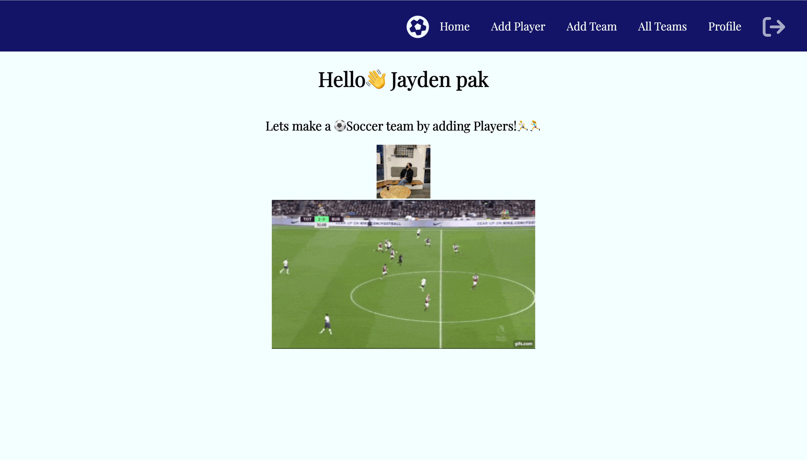
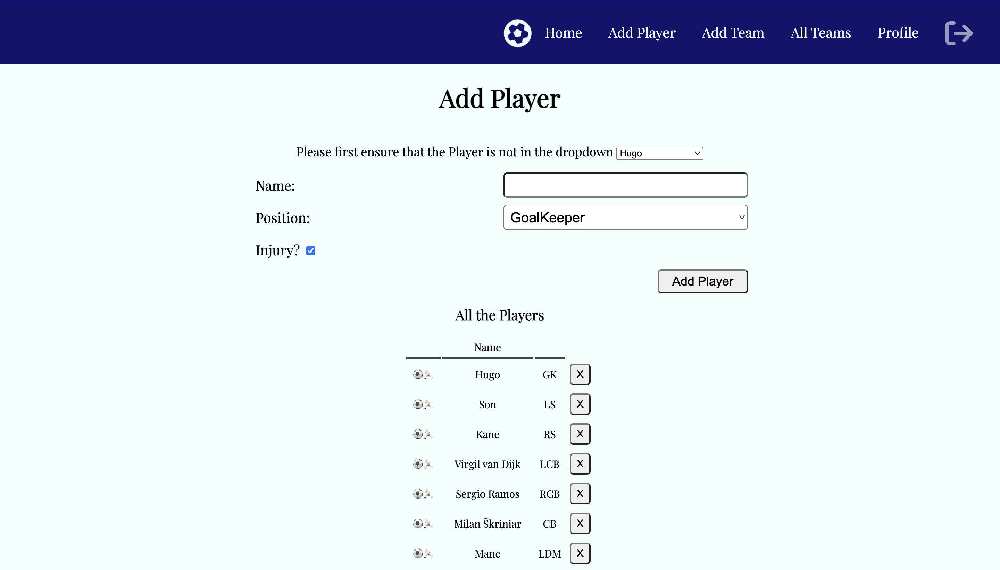
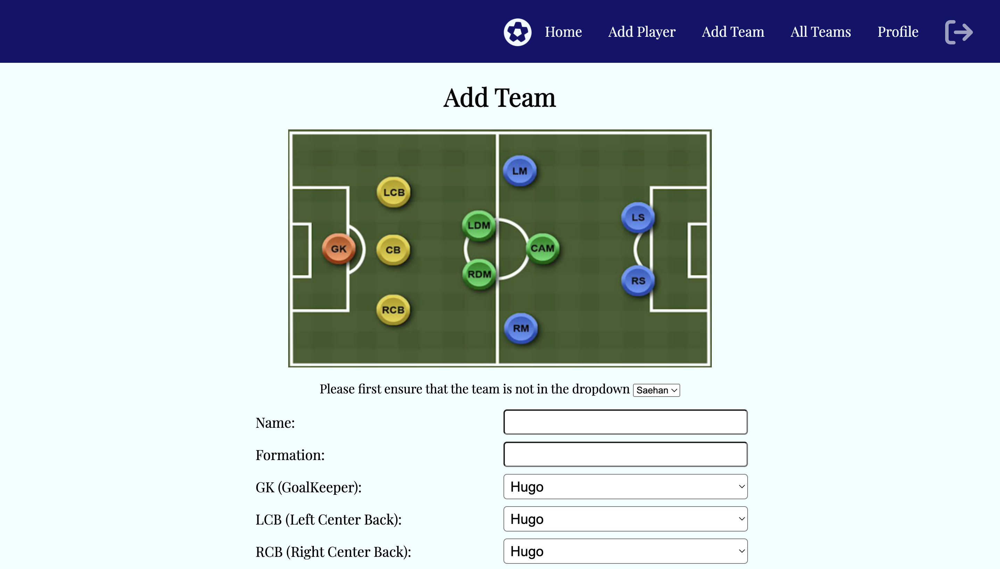

# Spurs-best-eleven

Spurs-best-eleven is a web site to build a soccer team with customizing a team feature by adding new players. 

I started this project with a plan to keep track of Tottenham hotspur matches and comment about previous matches and choose best eleven players for the next match.

---

### Click [Here](https://spurs-best-eleven.herokuapp.com/) to see the deployed app.

### Click [Here](https://trello.com/b/BaDLAidW/unit2-project) to see the initial Trello planning.

---

## Phtos of App Pages 📸

---

## Technologies Used 💾

---

## Icebox Items 🧊
- [ ] CSS update with Tottenham Hotspurs features
- [ ] Add match schema
- [ ] Add comment features on the match page
- [ ] Add update feature for players
- [ ] Add photos of all soccer positions

